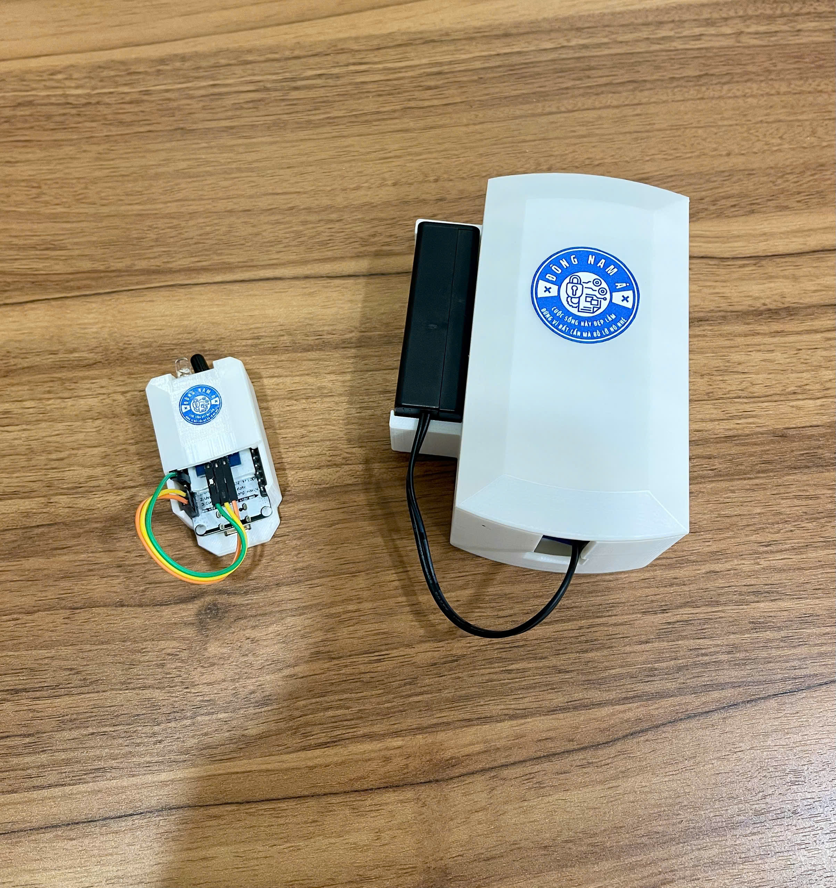

# 🔐 Smart Door Lock Notification Device

## 📌 Introduction

This is my very first project as a university student.  
Although it might seem simple, it's a meaningful first step that lays a **solid foundation for future improvements**.  
That's why I want to share it with everyone.

## 📖 Description

The project aims to solve a **very common issue in Vietnamese households**: forgetting to lock the door.

Unlike modern smart homes, most families in Vietnam still use **traditional padlocks**.  
This device is designed to detect whether the **door has been closed and the padlock has been properly secured**.

If the system detects that the lock is **not engaged**, it will:

- 🔔 Trigger a **sound alert**
- 📱 Send a **notification to the user's smartphone via Blynk app**

👉 The primary target of this project is **Vietnamese users**, with a focus on simplicity, practicality, and affordability.

## ✨ Features

- Detects door closure and lock status
- Sends notification via **Blynk App**
- Emits audible warning via buzzer
- Designed specifically for **traditional padlock usage**

## 🧰 Tech Stack

- **Microcontroller**: ESP32, ESP8266
- **Sensors**: Infrared Obstacle Sensor (MC-31)
- **Connectivity**: Wi-Fi (Blynk Platform)
- **Alert**: DFPlayer + Buzzer
- **Power**: 5V adapter or battery bank

## 🚀 Setup & Installation

1. Clone this repository
2. Flash the firmware to ESP32 using Arduino IDE
3. Configure Wi-Fi and Blynk Auth Token in `config.h`
4. Connect hardware according to circuit diagram (see below)

## 🕹️ How to Use

1. Install the Blynk app on your phone
2. Log in with your account and add the provided **Auth Token**
3. Power on the device
4. Test by opening and locking the door – receive alerts if door is left unlocked

## 📸 Demo

<!-- Replace with image or GIF later -->
 

## 📍 Project Status

✅ **Completed** – The system is functional and tested with real hardware.

## 👤 Author

**Do Duc Nghia** – Electronics Engineering Student @ HCMUT  
📫 Email: [dungnhannghia2605@gmail.com](mailto:dungnhannghia2605@gmail.com)  
🌐 Facebook: [fb.com/ducnghiadoo](https://facebook.com/ducnghiadoo)

---

